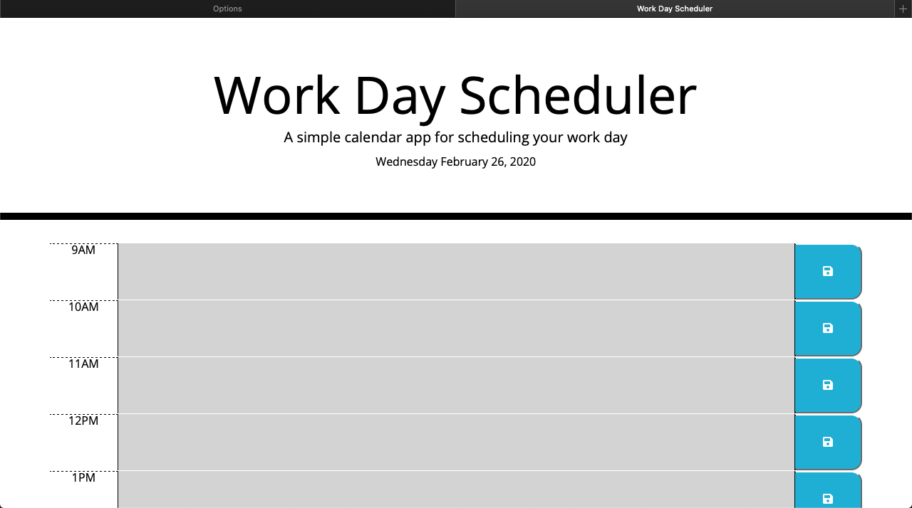

# 01 PROJECT OPERATION

This project was a text to see how we would react to API's and jQuery. Creating variables and implementing them into a for loop to create a daily work scheduler. I had to link moment.js to be able to run the API so that my page would be dynamic with the time and date. 

## PROJECT USES

The use of this project was to create a daily work scheduler.

## GETTING STARTED

To get started I had to go through some of the class jQuery and API lessons and activities that we did in class. It was a real challenge and I certainly had a hard time with completing this assignment. 

## GETTING HELP

To get help with this assignment I went to the previous activities and Youtube videos. 

## PROJECT CONTRIBUTORS

The project is maintained and contributed by the Ryan Guy.

Website Link - https://virtualmiracle-lab.github.io/05-thirdpartyAPI/

